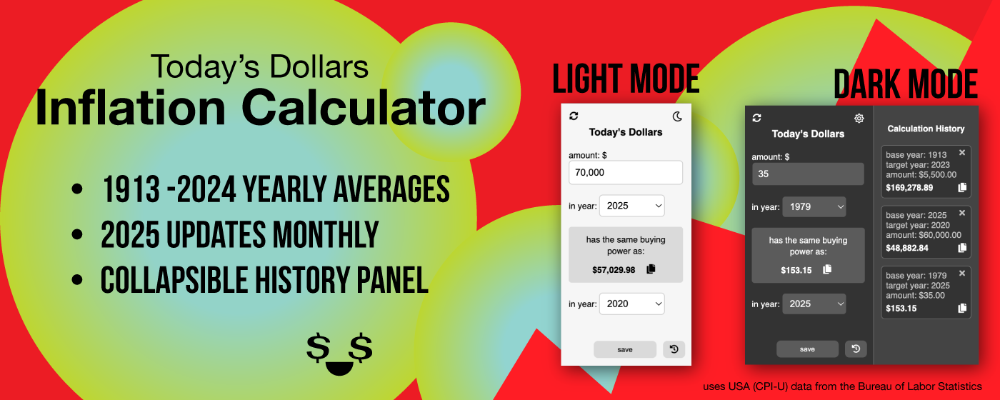

I just published version 3.0 of my Chrome Extension, Today's Dollars! Let me share the backstory before diving into the new features and why I’m writing this.

**Where we started?**

In 2023, I challenged myself to create and publish a Chrome Extension. If you’ve ever talked to me for more than five minutes, you know I have a passion for numbers and budgets. I found myself wondering: What if I could update all the numbers on a webpage to reflect inflation adjusted amounts? Is my grocery spending getting out of control? How much of that is due to inflation?

While I was able to find and update every dollar amount on a page, determining the base year for each figure wasn’t straightforward. After getting way too deep in the weeds, I had to step back and ask: What am I actually trying to accomplish? I decided to simplify my approach and create a calculator instead. Lucky for me, the Bureau of Labor Statistics provides inflation data for free.

I use React and TypeScript daily as an Application Developer. Since this calculator was relatively simple, I challenged myself to build it using only JavaScript, HTML, and CSS. I figured it would be a good refresher, and it definitely was!

There was a learning curve in understanding how Chrome Extensions work, formatting the manifest file correctly, creating promo materials at the right dimensions, and properly labeling files. After five days of development (and many failed publishing attempts for different reasons), I finally got approved in May 2023!

**Where we're at?**

Since then, I’ve diligently updated the inflation data as new years rolled in, and I’ve built a loyal user base. Thank you for sticking with me! In February 2024, my extension was recognized as a Featured Extension, a designation awarded only to high-quality extensions.

Recently, I had an idea for a new feature and ran it by a few of my OG users. A collapsible history panel where you can save your calculations for reference. They loved the idea! So, over the past few days, I’ve been coding away and updating the design.

**Why am I writing this?**  
Because I’m proud of the work I did, and I want people to see it. I also want feedback! What would you like to see next? I’ve enabled support tickets on my listing so I can hear from you, or you can try it out and reach out to me here. Check out my extension! 👉 [todaysdollars.com](https://chromewebstore.google.com/detail/todays-dollars/bfdehmfnafpnhfgaocbkjdidgcomapik)

Thank you for reading to the end, and thank you to everyone who has supported me along the way! This is a passion project—I do it for free and have elected not to collect any data or run ads. My goal is to contribute something that people find useful.

Now, check out some media from the listing page!

